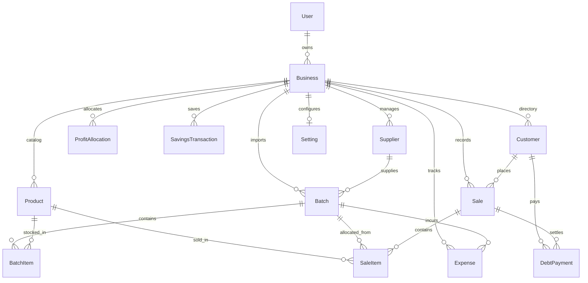

# AVENCIA 2.0 — PAGE LAYOUT & DATABASE ARCHITECTURE GUIDE

This document provides a complete, top-to-bottom visual layout breakdown of every page in **Avencia 2.0**, followed by a comprehensive overview of the backend architecture, Prisma database schema, and entity relationships.

---

# PART 1: PAGE-BY-PAGE VISUAL & LAYOUT BREAKDOWN (TOP TO BOTTOM)

Every page in Avencia 2.0 follows the **Royal Indigo & Emerald Teal** design system built with Tailwind CSS, Lucide icons, responsive mobile cards, and WCAG-compliant high-contrast elements.

---

## 0. GLOBAL SHELL & OVERLAYS

### A. Quick PIN Lock Overlay (`QuickPinLock.tsx`)
*Appears on initial session load if a 4-digit PIN is set in Settings.*
- **Backdrop**: Full-screen frosted glass (`bg-slate-900/70 backdrop-blur-xl`).
- **Modal Card**: Central `rounded-3xl border border-slate-100 shadow-2xl p-8 max-w-sm w-full`.
- **Top Header**: Gradient logo container with official Avencia Gold Logo, Lock icon (`<Lock />`), and title *"Avencia Quick PIN"*.
- **PIN Indicator Dots**: 4 circular indicators (`bg-indigo-600` when filled, `border-slate-300` when empty).
- **Tactile Keypad**: 3×4 numeric keypad grid (`1–9`, `Clear`, `0`, `⌫ Backspace`).
- **Footer**: Security badge (`<ShieldCheck /> Protected by Avencia OS Session Lock`).

### B. Top Header Bar (`Header.tsx`)
*Fixed at the top of every screen on desktop and mobile.*
- **Left Side**: Side drawer toggle button (mobile), Avencia Brand Badge with Gold Logo, and active page title.
- **Right Side**:
  - **Quick POS Sale Button**: Glowing Indigo pill (`+ New Sale`).
  - **Quick PIN Lock Button**: Instant session lock icon.
  - **Profile Avatar & Link**: User profile link with brand logo.

### C. Desktop Navigation Sidebar (`Sidebar.tsx`)
*Fixed left sidebar on medium/desktop screens (`md:block`).*
- **Header**: Avencia Gold Logo badge, version tag (`v2.0.0`), and business name.
- **Main Navigation Links**: Dashboard, Sales, Products, Inventory, Batches, Expenses, Profit Allocation, Customers, Suppliers, Reports, Settings.
- **Active State**: High-contrast Royal Indigo pill (`bg-indigo-600 text-white shadow-md shadow-indigo-500/20`).

### D. Mobile Navigation Bar (`MobileNav.tsx`)
*Fixed bottom bar on mobile screens (`md:hidden`).*
- **4 Primary Tabs**: Dashboard, Sales, Products, Inventory with active indicators.

### E. Floating Action Button (`FloatingActionButton.tsx`)
*Context-aware circular action button fixed at bottom-right on mobile.*
- Dynamically changes label and custom event based on active route (e.g. `+ Add Product`, `+ New Sale`, `+ Log Expense`).

---

## 1. DASHBOARD / HOME (`/`)

### Layout Breakdown (Top to Bottom):
1. **Top Low-Stock Alert Banner** *(Conditional)*:
   - Amber alert card (`bg-amber-50 border-amber-200`) displaying low stock items count with a direct link to `/inventory`.
2. **Financial KPI Stat Grid** (4 Cards):
   - **Gross Sales Revenue**: Total sales amount with percentage change indicator.
   - **Net Profit**: Realized net profit (Gross Profit − Expenses).
   - **Outstanding Customer Debt**: Total unpaid balance due across partial/credit sales.
   - **Active Stock Batches**: Total active import batches and total items in stock.
3. **Quick POS Action Bar**:
   - Primary action buttons: `+ Record New Sale`, `+ Add Product`, `+ Log Batch`, `+ Log Expense`.
4. **Recent Sales Activity Section**:
   - Section header with *"View All"* link.
   - **Desktop**: Table showing Sale Date, Customer, Items Count, Payment Method, Amount, Status badge, and Receipt action button.
   - **Mobile**: Responsive card list with status badges (`COMPLETED`, `PARTIAL`, `UNPAID`, `VOIDED`).

---

## 2. PRODUCT CATALOG (`/products`)

### Layout Breakdown (Top to Bottom):
1. **Page Header & Summary Metrics**:
   - Title *"Product Catalog"*, subtitle, total catalog count, and `+ Add Product` primary button.
2. **Search & Filter Bar**:
   - Search input (searches by Name, Barcode, SKU, Brand, Category).
   - Category filter pills (`All`, `Perfumes`, `Oils`, `Body Care`, etc.).
3. **Products Grid / Card List**:
   - **Product Card Content**:
     - Brand & Category tags.
     - Product Name & Volume/Size.
     - Barcode & Auto-generated SKU (`AV-XXX-100ML-XXXX`).
     - Selling Price (`GH₵`) vs Default Cost Price (`GH₵`).
     - Remaining Stock level badge (`In Stock` vs `Low Stock` alert).
     - Action buttons: `Edit Product` (pencil icon).
4. **Add / Edit Product Modal** *(Overlay)*:
   - Header with dismiss button (`X`).
   - Barcode Scanner Trigger & Input field.
   - Product Name (required).
   - **Auto-SKU Row**: Input field + `⚡ Auto-Generate` magic button.
   - Category, Brand, Size/Volume.
   - Selling Price (`GH₵`) & Default Cost Price (`GH₵`).
   - Low Stock Alert Threshold (default: 3).
   - Optional Batch Selection & Initial Stock.
   - Form actions: `Cancel`, `Save Product` (with loading spinner).

---

## 3. IMPORT BATCHES & BATCH DETAILS (`/batches` & `/batches/[id]`)

### A. Batches Directory (`/batches`)
1. **Header & New Batch Trigger**: Title, description, and `+ New Batch` primary button.
2. **Batch Status Filter Tabs**: `All Batches`, `Active`, `Completed`, `Archived`.
3. **Batch Cards Grid**:
   - Reference ID (e.g. `BATCH-2026-001`).
   - Purchase Date & Supplier Name.
   - Purchase Cost (`GH₵`), Additional Costs (Transport/Customs `GH₵`), Total Investment (`GH₵`).
   - Realized Revenue & Net Profit ROI percentage badge.
   - Remaining Stock Progress Bar.
   - Action: `View Batch Details`.
4. **New Batch Modal** *(Overlay)*:
   - Reference, Purchase Date, Supplier Selector, Additional Transport Costs field, Notes.

### B. Batch Detail View (`/batches/[id]`)
1. **Header**: Navigation back arrow (`← Batches`), Batch Reference, Status badge (`ACTIVE` / `COMPLETED`).
2. **Batch Financial Overview Cards**: Total Cost, Additional Costs, Total Investment, Gross Realized Revenue, Net Profit.
3. **Action Toolbar**: `+ Add Item to Batch`, `+ Log Transport/Car Fee`, `Close Batch`.
4. **Itemized Batch Table / Mobile Cards**:
   - Product Name, SKU, Barcode.
   - Quantity Purchased, Quantity Remaining.
   - Unit Cost Price (`GH₵`), Total Line Cost (`GH₵`).
5. **Inline Product Creation Modal** *(Overlay)*:
   - Full product form with Auto-SKU generator and barcode scanner.

---

## 4. INVENTORY LEDGER (`/inventory`)

### Layout Breakdown (Top to Bottom):
1. **Page Header & Summary Badges**:
   - Total Units in Stock, Total Inventory Valuation (`GH₵`), Low Stock Count.
2. **Low Stock Warning Banner** *(Conditional)*:
   - List of items requiring restocking with direct WhatsApp vendor reorder links (`https://wa.me/...`).
3. **Filter Pills**: `All Stock`, `Low Stock`, `Out of Stock`, `Adjustments`.
4. **Real-Time Inventory Ledger Table / Mobile Cards**:
   - Product Name & SKU.
   - Current Stock Level.
   - Unit Selling Price & Inventory Valuation.
   - Low Stock Threshold.
   - Actions: `+ Manual Adjustment` (`DAMAGE`, `LOSS`, `TESTER`, `RESTOCK`).
5. **Manual Stock Adjustment Modal** *(Overlay)*:
   - Reason dropdown, Quantity, Note, and submit button.

---

## 5. RAPID POS & SALES HISTORY (`/sales`)

### Layout Breakdown (Top to Bottom):
1. **Page Header & POS Launcher**:
   - Title, Total Sales Count, Today's Sales Volume, and `+ Rapid Sale Entry` primary button.
2. **Rapid Sale Entry Modal / POS Terminal** *(Overlay)*:
   - **Customer Selector**: Search/Select Customer or create guest sale.
   - **Barcode Camera Scanner Trigger**: Opens live camera scanner or file photo scanner overlay.
   - **Item Selector Rows**: Product dropdown, Unit Price (`GH₵`), Quantity, Line Subtotal. `+ Add Item` button.
   - **Discount Input**: Custom discount (`GH₵`).
   - **Payment Method Selector**: Cash, Mobile Money, Bank Transfer, Card.
   - **Payment Status & Credit Sale Inputs**:
     - `PAID` vs `PARTIAL` vs `UNPAID`.
     - Amount Paid input (calculates Balance Due live).
   - **Totals Summary**: Subtotal, Discount, Total Amount Due, Balance Due.
   - Submit Button: `Complete Sale & Print Receipt`.
3. **Camera Scanner Overlay (`CameraScanner.tsx`)**:
   - Live camera viewport with scan beam animation.
   - **HTTPS Error / HTTP Explanation Card**: Clear guide for local HTTP testing (`chrome://flags`).
   - **`[📷 Snap / Upload Photo]` Button**: Native camera/file upload for barcode decoding from photos.
4. **Sales History Table / Mobile Cards**:
   - Date & Time, Customer Name, Items Count, Total Amount (`GH₵`), Amount Paid vs Balance Due, Status badge (`COMPLETED`, `PARTIAL`, `UNPAID`, `VOIDED`).
   - Actions: `View Invoice`, `Print / Share Receipt`, `+ Record Payment`, `Void Sale`.
5. **Printable Receipt Modal (`ReceiptModal.tsx`)**:
   - Avencia Black Logo header, Store details, Invoice number, Date/Time.
   - Itemized list (Product, Qty, Unit Price, Total).
   - Totals, Payment Method, Amount Paid, Balance Due.
   - **Direct WhatsApp Share Button**: Formats itemized receipt text and opens `https://wa.me/phone?text=...`.
   - **Print Button**: Triggers `window.print()`.

---

## 6. EXPENSE TRACKING (`/expenses`)

### Layout Breakdown (Top to Bottom):
1. **Page Header & Log Expense Button**:
   - Title, Total Expenses (`GH₵`), Batch-specific vs Operational Expenses breakdown, `+ Log Expense` primary button.
2. **Category Filter Pills**:
   - `All Categories`, `Transport`, `Delivery`, `Packaging`, `Marketing`, `Restocking`, `Operations`, `Other`.
3. **Expenses Table / Mobile Cards**:
   - Expense Date, Category badge (`rose-50 border-rose-200`), Description, Associated Import Batch, Amount (`GH₵`).
4. **Log Expense Modal** *(Overlay)*:
   - Category selector, Description, Amount (`GH₵`), Optional Import Batch assignment, Date picker, Submit button.

---

## 7. PROFIT ALLOCATION & SAVINGS LEDGER (`/profit`)

### Layout Breakdown (Top to Bottom):
1. **Header & Realized Allocatable Profit Banner**:
   - Realized Gross Profit − Expenses − Previously Allocated Profit = **Available Allocatable Profit (`GH₵`)**.
2. **50 / 30 / 20 Quick Preset Allocator**:
   - **50% Savings**: Auto-calculated (`GH₵`).
   - **30% Needs**: Auto-calculated (`GH₵`).
   - **20% Wants**: Auto-calculated (`GH₵`).
   - `Apply 50/30/20 Allocation` action button.
3. **Custom Allocation Form**:
   - Type selector (`SAVINGS`, `NEEDS`, `WANTS`), Amount (`GH₵`), Source/Notes, Submit button.
4. **Savings Transaction Ledger (`DEPOSIT`, `WITHDRAWAL`, `ADJUSTMENT`)**:
   - Total Savings Balance (`GH₵`), Deposit history, Manual withdrawal/adjustment modal.

---

## 8. CUSTOMER CRM & DEBT COLLECTION (`/customers`)

### Layout Breakdown (Top to Bottom):
1. **Header & Add Customer Trigger**:
   - Title, Total Customers, Total Active Debtors, Total Debt Outstanding (`GH₵`), `+ Add Customer` button.
2. **Filter Tabs**: `All Clients`, `Debtors Only`.
3. **Customer Directory Cards Grid / Table**:
   - Customer Name, Phone (auto-formatted `+233...`), Email.
   - Total Orders, Lifetime Spend (`GH₵`), Total Gross Profit (`GH₵`).
   - **Outstanding Debt Badge** (`GH₵` balance due).
   - **WhatsApp Debt Reminder Button**: Generates payment reminder text and opens WhatsApp.
   - **Record Payment Button**: Opens Debt Payment modal.
4. **Add Customer Modal & Debt Payment Modal** *(Overlays)*.

---

## 9. BUSINESS REPORTS (`/reports`)

### Layout Breakdown (Top to Bottom):
1. **Page Header & Date Range Controls**:
   - Preset filters (`Today`, `This Week`, `This Month`, `This Year`, `Custom Date Range`).
   - `Print / Export Report` action button.
2. **Report Navigation Tabs**: `Sales Report`, `Product Performance`, `Batch Analytics`, `Expense Report`, `Profit Summary`.
3. **Report Tab Content**:
   - Summary Metric Cards.
   - Detailed Breakdown Tables & Performance Cards.

---

## 10. SYSTEM SETTINGS & SUPPLIERS (`/settings` & `/suppliers`)

### A. Settings (`/settings`)
1. **Store Profile Card**: Business Name, Currency (`GHS`), Phone, Address.
2. **Store Preferences Card**: Default Payment Method, Low Stock Threshold.
3. **Security & Quick PIN Card**: 4-digit PIN setup, PIN change, PIN removal.

### B. Suppliers (`/suppliers`)
1. **Supplier Directory Grid**: Supplier Name, Contact Person, Phone, Email, Total Batches Supplied.
2. **Add / Edit Supplier Modal**.

---

# PART 2: BACKEND ARCHITECTURE & DATABASE RELATIONSHIPS

Avencia 2.0 uses **Next.js 15 App Router**, **Neon PostgreSQL**, and **Prisma ORM (v6)**.

---

## 1. ENTITY RELATIONSHIP DIAGRAM (ERD)

---

## 2. PRISMA SCHEMA & TABLE DEFINITIONS

### A. `User` & `Business`
- **`User`**: System account containing `id`, `name`, `email` (unique), `passwordHash`, `createdAt`, `updatedAt`.
- **`Business`**: Multi-tenant business container (`id`, `name`, `currency` default `"GHS"`, `ownerId` -> `User.id`).

### B. `Product` (Catalog)
- `id`, `businessId` -> `Business.id` (Cascade).
- `name`: Product title (e.g. *"Amber Wood Cologne"*).
- `sku`: Unique stock keeping unit code (auto-generated format: `AV-XXX-100ML-XXXX`).
- `barcode`: Universal product barcode (EAN-13, UPC, etc.).
- `category`, `brand`, `size`.
- `sellingPrice`: Decimal(12, 2) selling price (`GH₵`).
- `defaultCostPrice`: Decimal(12, 2) baseline cost price (`GH₵`).
- `lowStockThreshold`: Alert threshold integer (default: 3).
- `isActive`: Boolean soft-delete flag.

### C. `Batch` & `BatchItem` (Import Batches & FIFO Stock)
- **`Batch`**:
  - `id`, `businessId`, `supplierId` -> `Supplier.id` (SetNull).
  - `reference`: Unique shipment code (e.g. `BATCH-2026-001`).
  - `purchaseDate`: Date of purchase.
  - `status`: Enum (`ACTIVE`, `COMPLETED`, `ARCHIVED`).
  - `purchaseCost`: Total items cost (`GH₵`).
  - `additionalCosts`: Transport, car, customs fees (`GH₵`).
  - `totalInvestment`: `purchaseCost` + `additionalCosts` (`GH₵`).
- **`BatchItem`**:
  - `id`, `batchId` -> `Batch.id` (Cascade), `productId` -> `Product.id`.
  - `quantityPurchased`: Total units received.
  - `quantityRemaining`: Current unsold units remaining in batch.
  - `unitCost`: Per-unit purchase cost (`GH₵`).
  - `totalCost`: `quantityPurchased` * `unitCost` (`GH₵`).

### D. `Sale` & `SaleItem` (POS Transactions)
- **`Sale`**:
  - `id`, `businessId`, `customerId` -> `Customer.id` (SetNull).
  - `saleDate`: Date/time of transaction.
  - `subtotal`: Sum of item totals (`GH₵`).
  - `discount`: Custom discount applied (`GH₵`).
  - `totalAmount`: `subtotal` - `discount` (`GH₵`).
  - `totalCost`: Exact FIFO cost of items sold (`GH₵`).
  - `grossProfit`: `totalAmount` - `totalCost` (`GH₵`).
  - `paymentMethod`: Enum (`CASH`, `MOBILE_MONEY`, `BANK_TRANSFER`, `CARD`, `OTHER`).
  - `paymentStatus`: Enum (`PAID`, `PARTIAL`, `UNPAID`).
  - `amountPaid`: Amount paid by customer (`GH₵`).
  - `balanceDue`: `totalAmount` - `amountPaid` (`GH₵`).
  - `status`: Enum (`COMPLETED`, `PARTIAL`, `UNPAID`, `VOIDED`, `REFUNDED`).
- **`SaleItem`**:
  - `id`, `saleId` -> `Sale.id` (Cascade), `productId`, `batchId`.
  - `quantity`: Units sold.
  - `unitPrice`, `unitCost`, `revenue`, `cost`, `profit`.

### E. `DebtPayment` (Customer Credit & Partial Payments)
- `id`, `businessId`, `customerId` -> `Customer.id` (Cascade), `saleId` -> `Sale.id` (SetNull).
- `amount`: Payment amount (`GH₵`).
- `paymentMethod`, `paymentDate`.

### F. `Expense` (Operational & Batch Expenses)
- `id`, `businessId`, `batchId` -> `Batch.id` (Optional linkage for batch-specific transport/car fees).
- `category`: Enum (`TRANSPORT`, `DELIVERY`, `PACKAGING`, `MARKETING`, `RESTOCKING`, `OPERATIONS`, `OTHER`).
- `description`, `amount` (`GH₵`), `expenseDate`.

### G. `ProfitAllocation` & `SavingsTransaction`
- **`ProfitAllocation`**:
  - `id`, `businessId`, `amount`, `type` (`SAVINGS`, `NEEDS`, `WANTS`), `allocationDate`.
- **`SavingsTransaction`**:
  - `id`, `businessId`, `type` (`DEPOSIT`, `WITHDRAWAL`, `ADJUSTMENT`), `amount`, `referenceId`.

### H. `InventoryTransaction` (Stock Audit Ledger)
- `id`, `businessId`, `productId`, `batchId`.
- `type`: Enum (`PURCHASE`, `SALE`, `RETURN`, `ADJUSTMENT_IN`, `ADJUSTMENT_OUT`, `DAMAGE`, `TESTER`, `LOSS`).
- `quantity`, `referenceId`, `createdAt`.

---

## 3. CORE BACKEND DATA FLOWS

### A. Sale Creation & Atomic FIFO Deduction Flow
1. User submits sale payload (`items`, `discount`, `amountPaid`, `customerId`).
2. Server validates input & calculates `subtotal`, `totalAmount`, and `balanceDue`.
3. Inside a **Prisma Transaction**:
   - Queries `BatchItem` for active stock ordered by FIFO (`batch.purchaseDate ASC`).
   - Decrements `quantityRemaining` on each `BatchItem`.
   - If a batch's `quantityRemaining` hits 0, `syncBatchStatus()` updates batch status to `COMPLETED`.
   - Creates `Sale` and `SaleItem` records.
   - Logs `InventoryTransaction` records of type `SALE`.
   - Recalculates total `grossProfit`.
4. Returns serialized sale payload to client.

### B. Barcode Scanner Lookup Flow
1. Scan code received (`code`).
2. **Step 1 (Local DB)**: Queries `getProductByBarcode(code)`. If found, returns `source: "local"`.
3. **Step 2 (24h Cache)**: Checks in-memory server cache.
4. **Step 3 (Internet Registries)**: Queries Open Beauty Facts, Open Food Facts, UPC Item DB, and BigProductData with 3.5s timeout.
5. **Step 4 (Pre-fill)**: If metadata found, returns `source: "external"` with pre-filled Name, Brand, Size, Category.
6. **Step 5 (Fallback)**: If not found, returns `source: "none"` with manual entry fallback prompt.

---

## 4. SUMMARY TABLE OF ENUMS

| Enum | Options |
| :--- | :--- |
| **`BatchStatus`** | `ACTIVE`, `COMPLETED`, `ARCHIVED` |
| **`SaleStatus`** | `COMPLETED`, `PARTIAL`, `UNPAID`, `VOIDED`, `REFUNDED` |
| **`PaymentStatus`** | `PAID`, `PARTIAL`, `UNPAID` |
| **`PaymentMethod`** | `CASH`, `MOBILE_MONEY`, `BANK_TRANSFER`, `CARD`, `OTHER` |
| **`ExpenseCategory`**| `TRANSPORT`, `DELIVERY`, `PACKAGING`, `MARKETING`, `RESTOCKING`, `OPERATIONS`, `OTHER` |
| **`AllocationType`** | `SAVINGS`, `NEEDS`, `WANTS` |
| **`SavingsTransactionType`** | `DEPOSIT`, `WITHDRAWAL`, `ADJUSTMENT` |
| **`InventoryTransactionType`** | `PURCHASE`, `SALE`, `RETURN`, `ADJUSTMENT_IN`, `ADJUSTMENT_OUT`, `DAMAGE`, `TESTER`, `LOSS` |

---

*Documentation generated for Avencia 2.0 Production Release.*
